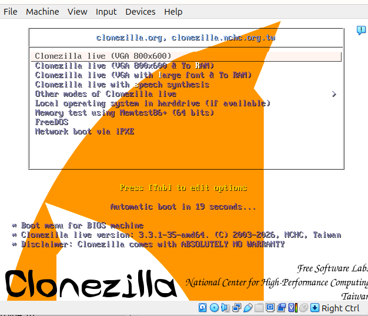
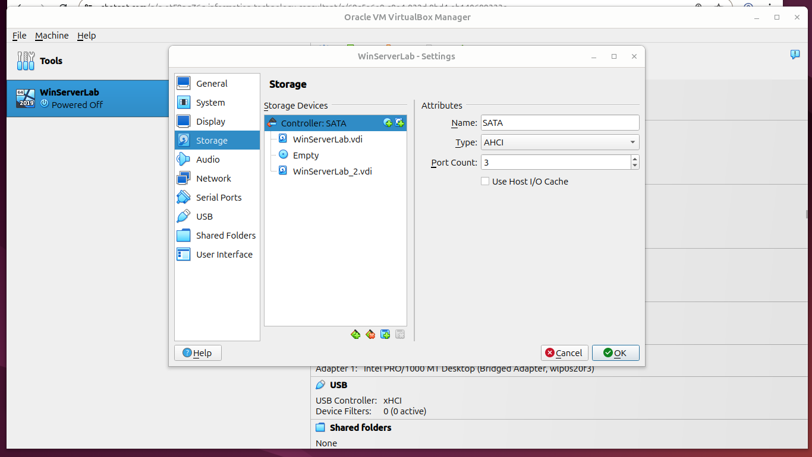
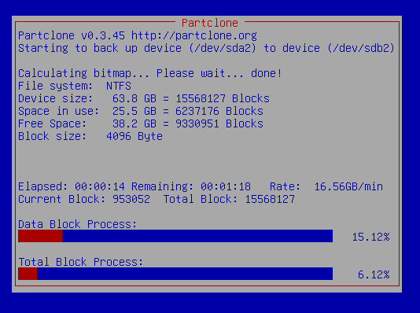
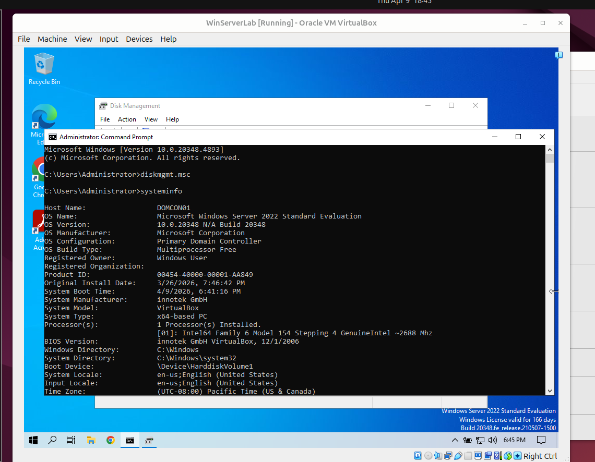

**Windows Clonezilla Disk Clone Lab**

Lab Objectives

* Perform disk-to-disk cloning of a Windows Server virtual machine
* Configure source and target virtual disks in VirtualBox
* Execute cloning with Clonezilla
* Validate cloned disk integrity in Windows Server

Clonezilla Boot

I booted Clonezilla from an attached ISO inside VirtualBox to begin the cloning workflow.

This screenshot shows the Clonezilla startup menu before entering disk-to-local-disk mode.

VirtualBox Storage Configuration

I configured the source disk and target disk under the SATA controller before running the clone.

This screenshot shows the source virtual disk, empty optical drive, and target disk attached inside VirtualBox.

Clone Execution

I ran the Clonezilla disk cloning process and monitored partition replication from source to target.

This screenshot shows Clonezilla actively copying NTFS data blocks from the source disk to the target disk.

Windows Validation

I booted the cloned Windows Server environment and verified system integrity using Disk Management and `systeminfo`.

This screenshot shows successful boot validation, preserved partitions, and system details after cloning.

0000000000

Key Skills Practiced

* Disk cloning
* Virtual disk attachment
* Clonezilla workflow
* Partition validation
* Windows Server administration

Summary

This lab demonstrates practical disk cloning of a Windows Server virtual machine using Clonezilla inside VirtualBox.

I configured storage correctly, executed the clone, and verified the cloned system booted successfully with intact partitions.

Navigation

[`Back to GitHub Profile`](https://www.github.com/cbueker-it)
